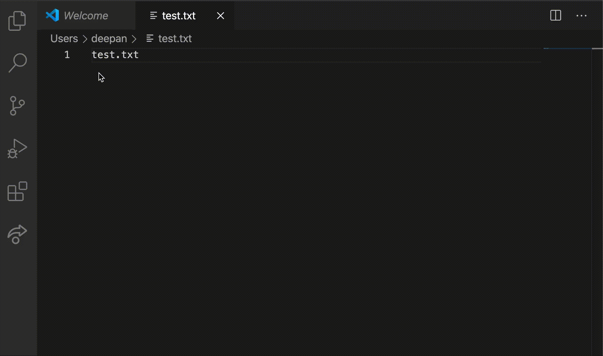

# nucleus-language-server

## Motivation

This language server improves developer experience on Nucleus by providing a common implementation for auto complete, validation and documentation of Nucleus elements across multiple code editors that support the LS protocol.

